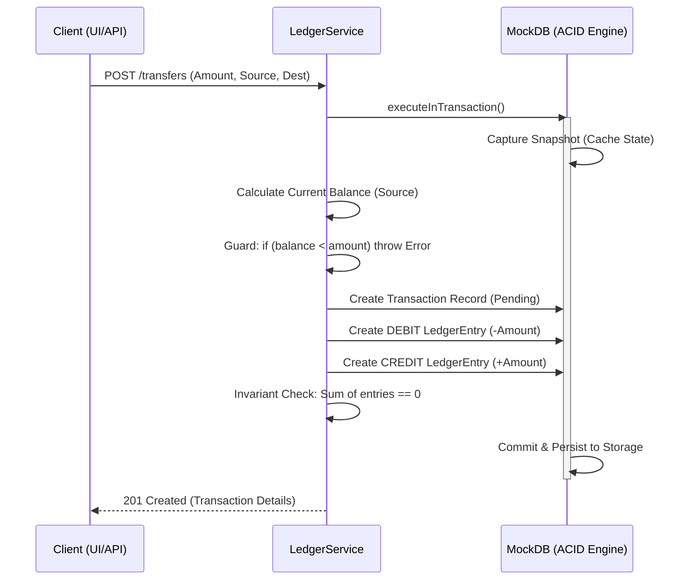
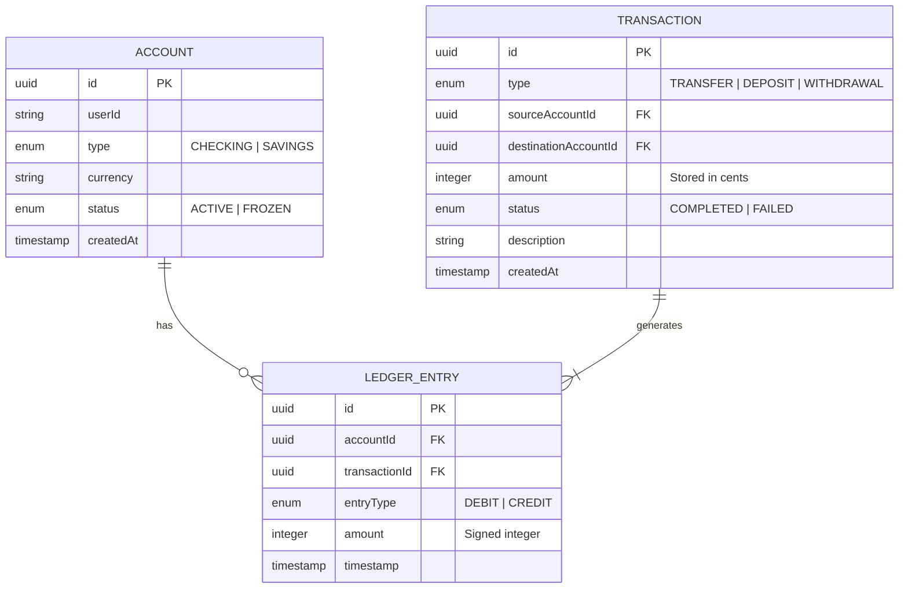

# Equilibrium Ledger Core | High-Integrity Financial Engine

Equilibrium is a robust financial ledger system built on the principles of **Double-Entry Bookkeeping** and **ACID Transactions**. It serves as a verifiable source of truth for financial movements, prioritizing correctness and auditability above all.

## 🚀 Design Decisions & Rationale

### 1. Double-Entry Bookkeeping Model
We treat every transaction as a zero-sum movement of value.
- **Atomic Pairings**: Every transfer generates a `DEBIT` entry (negative amount) and a `CREDIT` entry (positive amount).
- **Invariance**: The system verifies that `sum(entries_in_transaction) == 0` before committing to persistence. Value cannot be created or destroyed, only redistributed.

### 2. ACID Properties & Transaction Strategy
- **Atomicity**: The `MockDB` uses a snapshot-rollback mechanism. Before execution, the state is cached. If any business rule fails (e.g., overdraft), the state is restored to the snapshot.
- **Consistency**: All ledger balances are **Derived Truth**. Balances are calculated by summing the ledger entries on-the-fly, ensuring the balance is never out of sync with the history.
- **Isolation (Serializable)**: Transactions are processed via a sequential promise-queue. This enforces **Serializable Isolation**, the highest level of safety, preventing race conditions (like double-spending) by ensuring only one transaction modifies the state at any given time.
- **Durability**: Successful operations trigger an immediate commit to `localStorage`, simulating synchronous disk persistence.

### 3. Balance Integrity & Negative Prevention
The system enforces a **Strict Overdraft Prevention** policy. 
- Before a Debit is recorded, the engine performs a pre-flight balance calculation within the atomic transaction boundary.
- If the resulting balance would fall below zero, an `IntegrityViolation` is thrown, triggering a full transaction rollback.

## 📊 System Architecture

### Transfer Transaction Flow


### Entity Relationship Diagram (ERD)


## 🛠 Setup & Configuration

### Local Development
```bash
npm install
npm run dev
```

### Docker Setup (Recommended)
```bash
docker-compose up --build
```
The application will be accessible at `http://localhost:3000`.

## 🧪 API Demonstration
Use the provided `postman_collection.json` in the project root to test:
- **Balance Calculation**: Verify that the balance returned for an account matches the sum of its ledger entries.
- **Overdraft Guard**: Attempt a withdrawal larger than the balance. Verify it fails and no ledger entries are created.
- **Atomic Transfer**: Execute a transfer and verify both debit and credit entries are present in the audit log.
